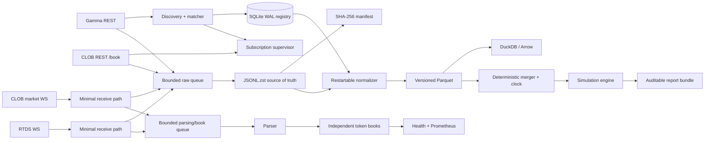
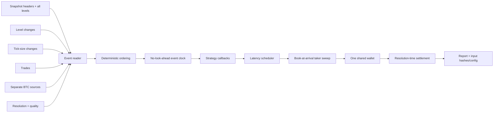

# Architecture

## Safety and process boundary

The running service is a public-data recorder. Its dependency graph has no authenticated endpoint,
credential model, signing primitive, wallet client, or exchange-order adapter. The backtest order
model is reachable only from offline replay commands.

All persisted wall-clock timestamps are UTC nanoseconds. `time.monotonic_ns()` accompanies local
network receipt and operational durations. A server display timezone never changes stored time.

## Component and data flow



The receiver captures UTC time, monotonic time, connection ID, and process sequence immediately.
It creates one lightweight immutable envelope and attempts non-blocking puts to the raw and parser
queues. It does no synchronous I/O or analytical work. The raw queue is the priority path; offline
normalization always works from finalized raw archives, so parser lag cannot destroy source data.

## Discovery and rollover

Gamma discovery combines a broad active Bitcoin event query with deterministic candidate slugs for
the previous, current, and upcoming aligned intervals. Slugs are only supporting evidence. The
matcher scores asset text, Up/Down wording, duration, tags/series, slug, exact directional outcomes,
numeric CLOB IDs, order-book enablement, and plausible timestamps. Acceptance requires the configured
score and an unambiguous label-to-token map. Near matches and ambiguous maps go to SQLite quarantine.

Polling is normally every 30 seconds and every 5 seconds around a 15-minute boundary. The candidate
window discovers upcoming markets before they open. Current, next, and recently closed tokens may
overlap in the desired subscription set. The old market is retained for a post-close grace period;
its registry metadata continues to be refreshed so close/resolution changes are captured.

## Initialization and recovery

For each accepted token, the supervisor gets a complete public `/book` response and records both the
raw body and request diagnostics. A snapshot replaces that token's entire in-memory book. A new
snapshot is requested after WebSocket connection, on a failed invariant, and every configured
validation interval. Reconnection marks every affected book uncertain before replacement; the
missing interval is never synthesized.

```mermaid
sequenceDiagram
  participant S as Supervisor
  participant REST as CLOB REST
  participant WS as CLOB WS
  participant B as Token book
  S->>REST: GET /book for UP and DOWN
  REST-->>S: raw snapshots + diagnostics
  S->>B: full replacement
  S->>WS: subscribe both token IDs
  WS-->>S: book / price_change / trade
  S->>B: ordered apply + invariants
  WS--xS: disconnect or heartbeat timeout
  S->>B: mark uncertain interval
  S->>WS: backoff, reconnect, resubscribe
  S->>REST: recovery snapshots
  S->>B: replace; close uncertainty only from receipt
```

## Queue and backpressure behavior

- `raw_max_events` bounds the source-of-truth queue. A full queue records exact dropped sequence
  bounds and forces unhealthy status. No silent overwrite is possible.
- `book_max_events` bounds live parsing/reconstruction. Its failures are counted separately; the
  original message may still be present in raw storage and can be reconstructed offline.
- `normalization_max_events` is reserved for a future concurrent normalizer; normalization is
  currently an explicit offline job, which avoids competing with capture.
- The raw worker batches up to `writer_batch_events` or `writer_batch_wait_ms`, then performs
  compression and file I/O in one dedicated thread. It rotates on elapsed time, estimated
  uncompressed bytes, market partition transition, or shutdown.

Raw queue saturation is a fidelity failure. The service records the sequence range, marks health
unhealthy, and does not claim replay completeness. At emergency disk space, it stops collection only
after closing archives as safely as possible; it never deletes old data.

## Raw storage and crash consistency

Each active partition has one `.jsonl.zst.partial`. Clean close flushes the Zstandard frame and file,
optionally fsyncs it, atomically renames it, computes SHA-256, and fsync-appends a manifest entry.
Startup scans partials. Complete newline-delimited envelopes that can be decoded are copied to a new
`recovered-*.jsonl.zst`; the untouched damaged input is renamed `.abandoned-*`. Recovery is marked
degraded in the manifest.

The envelope contains exact payload text. Binary frames are base64 with explicit encoding. Parsing
never edits that payload or causes its removal.

## Normalization

The normalizer scans only raw manifest entries that have not been processed at the same SHA-256.
It resolves mappings from Gamma raw data and the WAL registry, parses decimals directly into fixed
scales, writes schema-bound Parquet to temporary paths, validates row counts, atomically publishes,
and appends manifests. A SQLite checkpoint records each raw path/hash only after successful writes.

Unknown and malformed messages create quality rows and remain in raw storage. A new parser version
can rerun into a fresh storage root or after an explicit operator-controlled checkpoint reset. Normal
operation never mutates raw files.

## Book model

Each token has independent `SortedDict` bids and asks. A snapshot replaces both maps. A
`price_change` sets the reported absolute size at `(side, price)`; zero removes it. Parent sequence
and change index preserve intra-frame order. Cheap checks run after every event: price bounds,
nonnegative size, tick compliance, top-of-book agreement when supplied, and non-crossing. A failed
check invalidates the book and schedules recovery.

`tick_size_change` is a first-class normalized/replay event. The effective tick is retained per
token and remains authoritative for later WebSocket snapshots that omit the field; a REST snapshot
can refresh it after reconnect or recovery. This prevents discovery-time metadata from being reused
after a live tick transition.

Source hashes are retained as opaque values. No invented local hash is presented as equivalent to
the source algorithm.

## Replay and simulation



The realistic default uses local receive time. Before applying all events at a timestamp, orders
whose scheduled arrival is strictly earlier execute against prior state. Events at the timestamp are
then applied in deterministic order; arrivals equal to that timestamp execute afterward. A strategy
cannot query a future snapshot, resolution, reconciled trade, or BTC value.

Taker buys consume asks low-to-high and sells consume bids high-to-low, creating a fill per level.
Cash/inventory are preflighted so no implicit leverage or shorting occurs. Insufficient displayed
depth can yield a partial fill; insufficient bankroll/inventory rejects the intent. Latency is
sampled from a seeded constant, empirical, lognormal, or explicit zero-debug model.

## Monitoring and failure modes

The embedded HTTP server listens on `127.0.0.1:9108` by default. `/health` evaluates feed and
snapshot freshness, connections, book validity, queue pressure, drops, clock synchronization, and
disk thresholds. `/metrics` exports Prometheus text. The atomic status file remains readable even
when the process is down.

SIGTERM/SIGINT stop new work, close sockets, drain parser and raw queues within the configured
timeout, finalize archives/manifests, checkpoint the last issued sequence, close databases, and
release the lock. Every new process gets a new run and connection UUID linked to the prior run.
