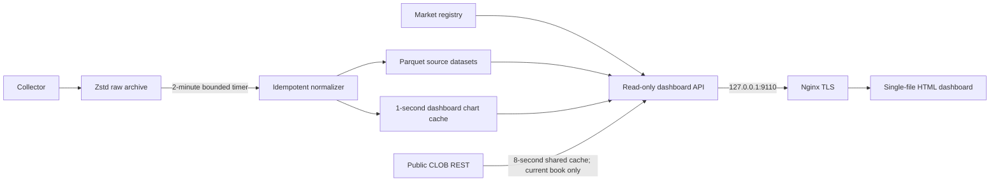

# BTC 15-minute data dashboard

The dashboard is a public, read-only presentation layer over the collector archive. It has no wallet,
authentication, signing, order, or trading code. Nginx terminates TLS and proxies only to a loopback
HTTP service on `127.0.0.1:9110`.

## What the interface shows

- A time-sorted slug browser that refreshes from the market registry every 30 seconds.
- UP and DOWN best-bid, best-ask, midpoint, and bid/ask bands over the selected 15-minute interval.
- A separate spread panel for each outcome and the binary complement gap.
- A time cursor. Clicking the chart reconstructs both Level-2 books at that local receipt time.
- Up to 30 price levels on each side, with per-level and cumulative share depth.
- Captured public trades and separate Binance/Chainlink BTC reference prices.
- Recording, normalization, coverage, collector-health, and data-source indicators.

The browser uses display floats only after the API has supplied exact scaled integers. Stored prices
and sizes remain fixed-scale integers. A midpoint is explicitly presented as derived and not as an
executable fill price.

## Data flow



Chart cache files live under:

```text
data/normalized/dashboard/markets/<condition_id>.json
data/normalized/dashboard-market-index.json
```

They retain one last top-of-book observation per token per second. They are derived, replaceable, and
never supersede raw or Parquet data. `polymarket-bt dashboard-reindex` rebuilds them from Parquet.

## Book reconstruction

For a historical chart time, the API selects the latest full snapshot at or before the cursor for
each token, loads all snapshot levels, then applies later level changes in
`received_utc_ns, sequence, change_index` order. A positive size sets the absolute level size and a
zero size removes it. UP and DOWN are reconstructed independently.

For the current interval only, omitting the cursor permits a cached public CLOB REST snapshot. This
keeps the visible book fresh before the active raw segment is finalized. It is clearly labeled
`live_clob_rest`; historical requests never pretend that a later REST snapshot existed earlier.

## Automatic refresh

`polymarket-normalize.timer` runs a bounded four-file normalization batch roughly every two minutes.
This bounds memory while catching up safely. Raw partitions finalize at size/time thresholds even if
an old hour receives no subsequent event. The website reads the registry on every list refresh, so a
new slug appears immediately as `recording` or `upcoming`; its completed chart becomes available as
soon as the containing raw segment finalizes and the timer processes it.

## Local operation

```bash
POLYMARKET_BT_STORAGE_ROOT=/var/lib/polymarket-btc-backtester \
  .venv/bin/polymarket-bt dashboard \
  --config configs/collector.yaml \
  --host 127.0.0.1 \
  --port 9110 \
  --index web/index.html

curl -sS http://127.0.0.1:9110/api/health
curl -sS http://127.0.0.1:9110/api/markets
```

Useful endpoints:

```text
GET /api/health
GET /api/markets
GET /api/markets/<slug>/series
GET /api/markets/<slug>/book?at_ms=<unix_milliseconds>
GET /api/markets/<slug>/trades
```

Only `GET` and `HEAD` are accepted. Slugs are validated and SQLite values are parameterized. The
dashboard process runs as `polymarket-data`, has no credentials, binds only to loopback, and receives
public traffic exclusively through nginx.
