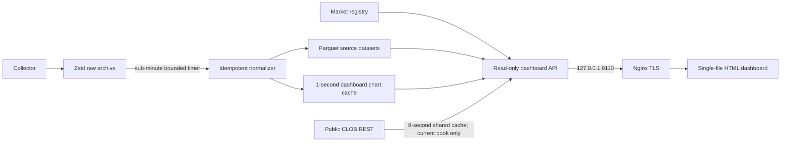

# BTC 15-minute data dashboard

The dashboard is a public, read-only presentation layer over the collector archive. It has no wallet,
authentication, signing, order, or trading code. Nginx terminates TLS and proxies only to a loopback
HTTP service on `127.0.0.1:9110`.

The site opens on a chooser with two destinations, plus an About page reachable from the top nav:

- **History** (`#/history`) — the recorded-market explorer described below.
- **Backtest** (`#/backtest`) — an interactive backtester over the same recorded books.
- **About** (`#/about`) — what the platform captures, a live coverage summary (captured trade
  volume, market and trade counts from `/api/stats`), and CSV downloads of the normalized data.

All three live in the single-file document; each is initialised the first time it is opened.

## What the interface shows

- A time-sorted slug browser that refreshes from the market registry every 30 seconds.
- UP and DOWN best-bid, best-ask, midpoint, and bid/ask bands over the selected 15-minute interval.
- A separate spread panel for each outcome and the binary complement gap.
- A time cursor. Clicking the chart reconstructs both Level-2 books at that local receipt time.
- Up to 30 price levels on each side, with per-level and cumulative share depth.
- Captured public trades and separate Binance/Chainlink BTC reference prices.
- Recording, normalization, coverage, collector-health, and data-source indicators.

The browser uses display floats only after the API has supplied exact scaled integers. Stored prices
and sizes remain fixed-scale integers. A midpoint is explicitly presented as derived and not as an
executable fill price.

## Data flow



Chart cache files live under:

```text
data/normalized/dashboard/markets/<condition_id>.json
data/normalized/dashboard-market-index.json
```

They retain one last top-of-book observation per token per second. They are derived, replaceable, and
never supersede raw or Parquet data. `polymarket-bt dashboard-reindex` rebuilds them from Parquet.

## Book reconstruction

For a historical chart time, the API selects the latest full snapshot at or before the cursor for
each token, loads all snapshot levels, then applies later level changes in
`received_utc_ns, sequence, change_index` order. A positive size sets the absolute level size and a
zero size removes it. UP and DOWN are reconstructed independently.

For the current interval only, omitting the cursor permits a cached public CLOB REST snapshot. This
keeps the visible book fresh before the active raw segment is finalized. It is clearly labeled
`live_clob_rest`; historical requests never pretend that a later REST snapshot existed earlier.

## Automatic refresh

`polymarket-normalize.timer` runs a bounded four-file normalization batch roughly every 45–55 seconds.
This bounds memory while catching up safely. Bounded runs prioritize the newest finalized archives,
so a completed 15-minute slug is published before older backlog; spare cycles continue working
backward. Raw partitions finalize at size/time thresholds even if an old hour receives no subsequent
event. The website reads the registry on every list refresh, so a new slug appears when it starts
recording; its completed chart becomes available as soon as its raw segment finalizes and the timer
processes it.

Raw writers rotate on wall-clock 15-minute boundaries. Consequently, the just-ended market's final
WebSocket segment becomes eligible for normalization immediately instead of waiting for a
process-relative rotation deadline. Completed markets with incomplete normalized coverage are
labeled `partial` or `pending`, never `ready`.

## Backtesting

The Backtest view runs the episode simulator documented in
[BACKTEST_METHOD.md](BACKTEST_METHOD.md) against a prepared workspace at
`/var/lib/polymarket-backtest`. That workspace holds the episode index and one
reconstructed depth tape per market; `polymarket-backtest-refresh.timer` extends it
a few minutes after each quarter-hour boundary, once the closing market has been
normalized. Existing tapes are never rebuilt, so a refresh costs only the new
markets.

The workspace must live **outside** the collector storage root. Both the CLI and
`run_dashboard` refuse otherwise, and the dashboard process opens it read-only —
a backtest cannot write anywhere.

### Why runs are jobs

A backtest replays every recorded book state of every selected market: roughly
0.07 s per market, so a full history is seconds now and minutes later. That is past
any reasonable HTTP timeout, so `POST /api/backtest` returns a job identifier and
the page polls it. One run executes at a time — the collector shares this machine,
and recording has priority over answering a form.

### Parameters and what they map to

| Form control | Simulator parameter | Optional |
|---|---|---|
| Buy when the price reaches | `entry_trigger_price_scaled`, evaluated on the **ask** | no |
| Never pay more than | `entry_limit_price_scaled` | defaults to trigger + 0.05 |
| Which side | `side_selection` (`favoured`, `up`, `down`) | no |
| Position size (USD) | `order_notional_scaled`, converted to shares at the fill price | no |
| Timed entry from/to minute | `entry_from_minute` / `entry_to_minute` | yes — off means the whole market |
| Stop loss | `stop_loss_price_scaled`, evaluated on the **bid** | yes — off means hold to settlement |
| Arm the stop later | `stop_loss_from_minute` | yes — off means live from the fill |
| Staking | `fixed` or `compound` | no — fixed is the default |
| Execution realism | `optimistic` / `base` / `pessimistic` preset | no |
| Entry execution policy | `adaptive_pov` / `twap` / `immediate` | no — adaptive POV is the default |
| Execution horizon (seconds) | `execution_horizon_seconds` | used by adaptive POV and TWAP; default 2 s |
| Date range | episode selection | yes — empty means everything recorded |

`stop_loss_from_minute` does not sell at that minute; it decides when the stop
starts *existing*. Before it the price is not consulted at all, so a dip in a
market with ten minutes left to recover cannot end the position, and only a late
collapse does. Arming it requires a stop-loss price; the API rejects the pair
otherwise rather than silently ignoring the minute.

### Entry execution policy

The entry signal decides *when to start buying*; the policy decides how to acquire the requested
position after that signal:

- **Adaptive POV** (default) sizes child taker orders from public volume already observed, with a
  partial TWAP floor, an adverse-price throttle, and deadline catch-up.
- **TWAP** splits the parent entry evenly over the selected horizon.
- **Immediate** submits one marketable sweep after latency, preserving the audited one-shot
  baseline. The horizon is ignored for this policy.

Adaptive POV and TWAP can only use book and trade state available at each child decision. Their
horizon is also capped by the entry-window end and market close; setting ten seconds cannot make an
order trade after either boundary. Every child still walks the recorded ladder under the chosen
realism preset and may fill partially or not at all. The result header identifies the policy (and
the horizon for sequential policies), so runs made with different execution assumptions are not
mistaken for the same strategy.

For adaptive POV and TWAP, the metrics panel also reports parent completion, implementation
shortfall, the benchmark-notional penalty for unfilled shares, adverse fill-to-deadline markout,
and their combined execution objective. This keeps a policy that improves price by simply not
finishing from looking artificially superior.

### Fixed and compounding stakes

Fixed staking risks the same dollar amount on every market. Compounding stakes the
whole cash balance available when a signal fires; exit proceeds and settlement
payouts remain locked until their recorded availability timestamp. The sequence
therefore becomes part of the result: wins raise a later stake, one full loss ends
the run, and the report says so
(`ended_early`, `markets_never_reached`) instead of leaving a flat tail that reads
like a quiet patch. Both are simulated literally, market by market, rather than
scaled from one fixed-stake pass — a $100 order's fills are not a tenth of a
$1,000 order's when the book is thin, which is exactly what this simulator exists
to measure. Compounding additionally reports the starting and final balance, total
return, drawdown as a percentage of the balance peak, and the available/locked
cash split at the observation horizon.

### Entry price is a result, not an input

"Buy when the price reaches 0.85" is not "buy at 0.85". If the ask is already past
the trigger when the entry window opens — which is normal when the window starts
late in the market — the entry fires immediately at whatever the ask is, bounded
only by "never pay more than". Since a binary bought at *p* must settle in your
favour *p* of the time merely to break even, drifting from 0.85 to 0.90 raises the
bar by five points and is routinely the whole explanation for a losing result with
a high side-correct rate. The report therefore states the size-weighted average
entry price, its distance above the trigger, and the break-even win rate it
implies, and warns when the gap reaches two cents.

### Fill quality is part of the result

Orders are executed by walking the recorded ladder under the selected realism
preset, so a position larger than the visible book fills partially or not at all.
The result reports requested versus filled shares, the fill rate, any shares the
exit could not clear, and — only for orders that were actually cut short — which
rule cut them:

| reported reason | meaning | who controls it |
|---|---|---|
| `limit_price` | the strategy's own "never pay more than" ceiling | the user |
| `max_price_through_touch` | the model refused to chase further from the best price | the realism preset |
| `displayed_depth_haircut` | displayed size assumed unreachable, or the per-level cap | the realism preset |
| `max_levels_swept` | the child reached the pessimistic preset's five-level cap | the realism preset |
| `book_depth_exhausted` | the complete recorded ladder ran out | the market |
| `stale_book` | the latest causal book was older than the preset allows | the realism preset |
| `book_state_uncertain` | reconstruction was invalid or inside a recorded uncertainty span | the data-quality gate |
| `below_minimum_order_size` | the order was smaller than the venue minimum (5 shares) | the position left to trade |
| `empty_book_side` | no quote at all on the side being traded | the market |

Immediate orders are matched only against the arrival-time ladder; later public prints never cap
or validate them. Adaptive POV uses only same-token volume already observed at each child decision,
and its completion/objective metrics describe the parent as a whole rather than reporting the old
post-arrival volume-window reasons.

Separating the first two matters: one is a parameter the user chose and can change,
the other is an assumption of the simulator. A $100,000 stake will show a low fill
rate rather than a fictitious fill.

### Checking a single market

Every row of the result table opens that market's recorded price path in the
History view, with each simulated fill drawn where it printed and when it arrived —
entry, stop loss, take profit, or timed exit. That is the audit trail for any
result that looks surprising: the mark sits above the ask line when the entry
chased, and below the bid line when the stop printed through its trigger.

### Endpoints

```text
GET  /api/backtest/meta          coverage, presets, exclusion reasons
POST /api/backtest               submit a run; returns {job_id, total_episodes}
GET  /api/backtest/<job_id>      state, progress, and the result once finished
```

`POST /api/backtest` is the only non-GET route. Bodies are capped at 16 KiB
independently of nginx, unknown fields are rejected rather than ignored, and job
identifiers are matched against a 32-character hexadecimal pattern before reaching
the service. Jobs are held in memory for an hour and are reproducible by
resubmitting the same parameters.

## Local operation

```bash
POLYMARKET_BT_STORAGE_ROOT=/var/lib/polymarket-btc-backtester \
  .venv/bin/polymarket-bt dashboard \
  --config configs/collector.yaml \
  --host 127.0.0.1 \
  --port 9110 \
  --index web/index.html \
  --backtest-workspace /var/lib/polymarket-backtest

curl -sS http://127.0.0.1:9110/api/health
curl -sS http://127.0.0.1:9110/api/markets
curl -sS http://127.0.0.1:9110/api/backtest/meta
```

Omit `--backtest-workspace` to serve the explorer alone; the Backtest view then reports itself
unavailable instead of failing.

Useful endpoints:

```text
GET  /api/health
GET  /api/stats
GET  /api/markets
GET  /api/markets/<slug>/series
GET  /api/markets/<slug>/book?at_ms=<unix_milliseconds>
GET  /api/markets/<slug>/trades
GET  /api/export.csv[?slug=<slug> | ?from_ms=<ms>&to_ms=<ms>]
GET  /api/backtest/meta
POST /api/backtest
GET  /api/backtest/<job_id>
```

Apart from `POST /api/backtest`, only `GET` and `HEAD` are accepted. Slugs are validated and SQLite
values are parameterized. The dashboard process runs as `polymarket-data`, has no credentials, binds
only to loopback, and receives public traffic exclusively through nginx.

### Downloading normalized data

`GET /api/export.csv` streams a chunked CSV (`slug, condition_id, outcome, t_ms, iso_time,
best_bid, best_ask, midpoint, spread`) of the full-resolution UP/DOWN top-of-book series — the same
recorded data the History charts read, decimal-converted from the stored fixed-point integers. It
serves the three ways the About page's download panel offers the data:

- `?slug=<slug>` — one market.
- `?from_ms=<ms>&to_ms=<ms>` — every market whose recording started in that window, combined into
  one file. Either bound may be omitted to leave that edge open; the two params cannot be combined
  with `slug`.
- No parameters — every recorded market.

The response streams with `Transfer-Encoding: chunked` rather than being buffered, so file size is
bounded by how long the client is willing to wait, not by server memory.
